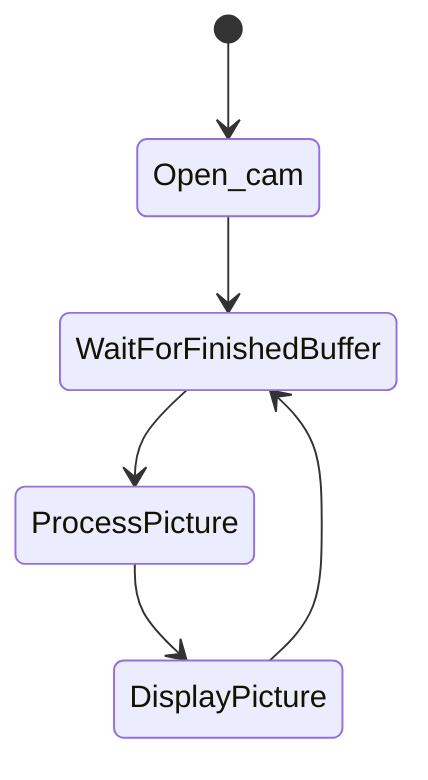
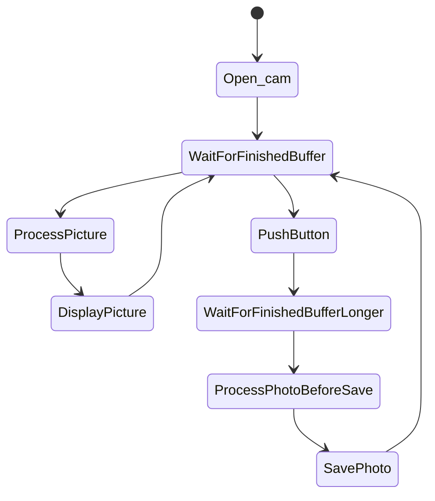
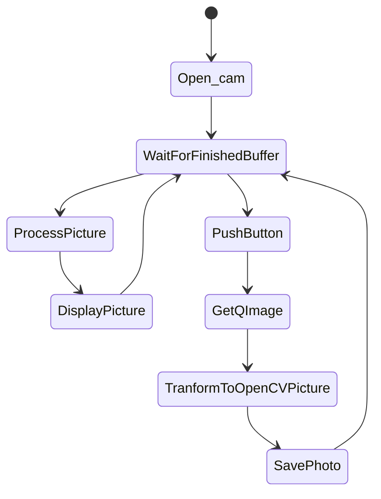
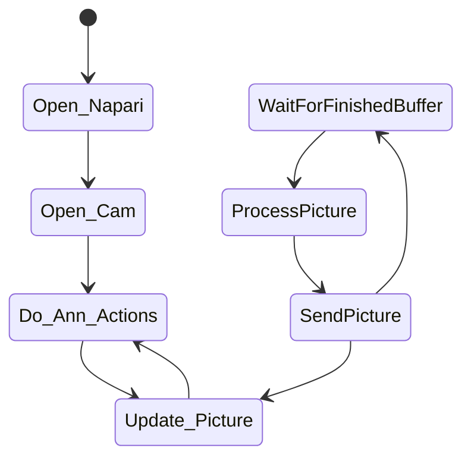
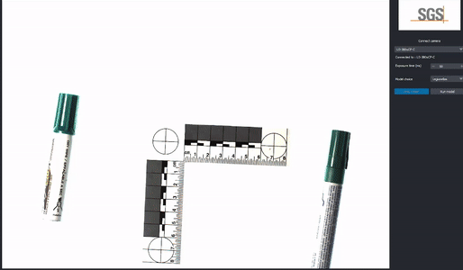
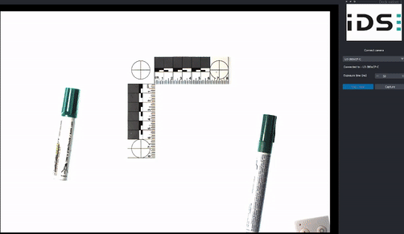

Camera IDS applications
---

We have noticed that the camera in the application “Visual_AI – Bacterio” is not refreshing well, it can display around 
5 frames per seconds. I t is not significant for this type of application, but sometimes, (when the user uses the system
for a too long time) it can lag. It is partially due to the buffer. We don’t know exactly the issue, but we know it 
could be due to the way we retrieve the picture. We say that because it is pretty smooth in IDS Vision Cockpit (around 
19-20 FPS). We are going to explain all the steps which were essential to improve the camera refreshment.

## IDS photo application

### Initial state (main branch)
The aim of this application is just to make some pictures thanks to the IDS camera (this project can be retrieved on my
Github : https://github.com/tcotte/IDS_camera). I am going to explain how was the process and for which reason it was 
not optimized.     
First of all, it is important to display a diagram which explain how we take video. 

From this, we made application to take photo when we push a button. We made an algorithm like this:

Sure it is working, but it is not optimized, it consumes a lot of memory when we *wait for finished buffer* two times
as the same time. I am not sure but I think when the application is used for a long time, the buffer is filled up, and 
the camera operates at a slower pace (the loss of speed is notifiable, because it could get down from 20 to 2 FPS) [1]. 
And, when the buffer is completely full, the application runs out (it is exactly what the application is doing). When 
the user reboot the application, the camera is refreshing at around 20 FPS because the buffer cleared up space when the 
device was closed.

### Speed enhancement (improve speed branch)
We started be use the last version of IDS_Peak, it was not the case before, we used the 1.2 version.     
To counter this issue of buffer, it was evident to not use two functions of *wait for finished buffer*. Our idea was
to retrieve the picture displayed in the QtApplication. We display a QImage (format of picture in PyQt app) after 
preprocessing data included in the buffer. 

The transformation from QImage to OpenCV RGB picture was not easy (and we try to be the more straightforward possible
to be fastest as we can) but it is worth because the creation of *png file* is made faster than. Moreover, now we have
not this issue of fill up buffer, so the speed of camera refreshment is not decreasing and the application is not going
to run out.

Now, we have made this, we can go further and test it on Napari. Napari is a free medical annotation tool in Python, the
*Visual_AI Bacterio* is built around it.

## Napari - IDS application
This code can be retrieved in : https://github.com/tcotte/napari-IDS/tree/dev
In Napari, it is easier to recover the preprocessing because we have just to get the data transmitted to the "Video" 
layer. So, we made this easily but, because of the Napari processing, the refreshment was running slow (we can't define
the number of FPS currently, but we are going to show a little video).

### Preprocessing enhancement
Then, we applied a little improvement made on the speed enhancement branch of *IDS-Camera* application:
instead of transforming the buffer data into RGBA (A for opacity) and transform to numpy 3D array getting rid of A 
channel, we transformed the buffer data into RGB and then in numpy 3D easily. Certainly, it improves speed, because we
are separating us one channel and little computations, but we can't see the differences from our eyes during the display.

### Multi-threading
We have thought about this in the past, but we never took the time to implement this. The aim of this technic is to
use a thread which is only affiliated at only one task [2]. In our case, we want to use one processor thread, just to get
image from the buffer, processing it and transmit it. This following diagram displays the behaviour of the different threads.

The diagram is not very explanatory because we don't see the distribution of actions between different threads. But, as we
explained, one node is only refreshing the camera and send the picture in another which has to handle Napari actions :
- Refreshing of the picture layer
- Management of annotations made by the user

### Results
The enhancement of preprocessing and the distribution of the tasks in different nodes bring us good results. In fact, we
get around 12 FPS as result (but we didn't know the number of FPS before, so we made videos to see the improvement).
In these GIFs, we can see that the movement of my hand is smoother on a video than in another.
The first GIF was made at the launching of the *Visual_AI Bacterio* application (I precise at the launching because we 
noticed that the application is going to be slower with the running time).

#### Visual Ai Bacterio speed

For this application we didn't need good frame rate but we can see it is very bad.

#### Multi thread app speed

It is better, we have around 12 FPS. Moreover, the speed don't decrease with the time and the application is sure to don't
run out because of the full buffer (because the buffer would not be full after multiple picture savings).

## TODO
There are good results but we can enhance what we have done improving the speed reducing the quality of the picture. I
think it can be made changing the parameters of the function *WaitForFinishedBuffer*.

We have also to implement this enhancement in the KFC project and to transform this dev-app into a real application and
push this changing into the **Napari-IDS plugin**.

Bibliography :
---
1. Buffer in photograhy documentation : https://www.photographytalk.com/beginner-photography-tips/understanding-your-cameras-image-buffer
2. Napari multi-threading docuementation : https://napari.org/api/napari.qt.threading.html

